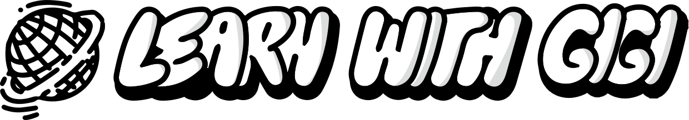

# Threejs

Progetto per imparare threejs & altre tecnologie.
## Avvia in locale
Clona il progetto in HTTPS

```bash
  git clone https://github.com/luigicarmone/threejs.git
```
oppure SSH & Github CLI

```bash
  SSH: git clone git@github.com:luigicarmone/threejs.git
  Github CLI: gh repo clone luigicarmone/threejs
```

Vai alla directory

```bash
  cd threejs
```

Installa le dipendenze

```bash
  npm install
```

Starta il progetto

```bash
  npm start
```


## Caratteristiche

- Light/dark mode toggle
- Fullscreen mode
- Responsive


## Feedback

Se hai commenti, contattami all'email luigicarmone16@gmail.com

## Tech Stack

**Client:** ThreeJS, React Three Fiber, React, TailwindCSS, Vite, Framer Motion, NextUI, 

**Server:** Nulla al momento.


## Screenshots


## License

[MIT](https://choosealicense.com/licenses/mit/)


## Autori

- [@luigicarmone](https://www.github.com/luigicarmone)

